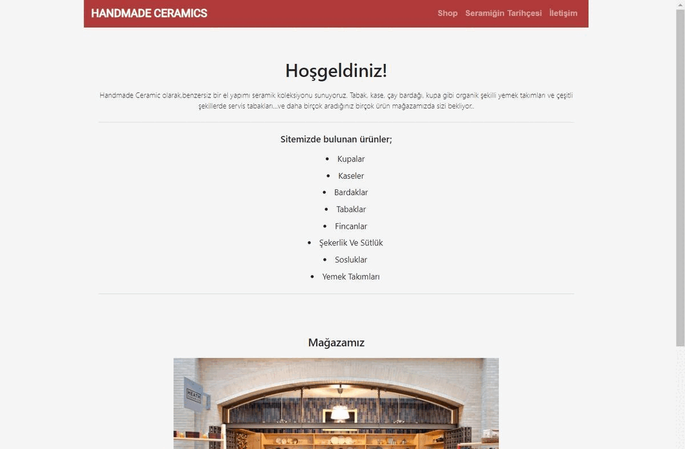

# Kodluyoruz - Bootstrap Ödev 1
## Handmade Ceramics web sayfasının tasarlanması 
Tasarım Görseli;



## About Project
Bu repo, [Kodluyoruz](https://kodluyoruz.org) Front-End Eğitiminde oluşturduğum ilk bootstrap ödevim.

Projemde linkler ve hooverlar ( navigation butonları, mağaza cardları ) çalışıyor.

## Installation
Projeyi klonlayarak kullanabilirsiniz. 
```
https://github.com/aybarsumur/handmade-ceramic-bootstrap.git
```